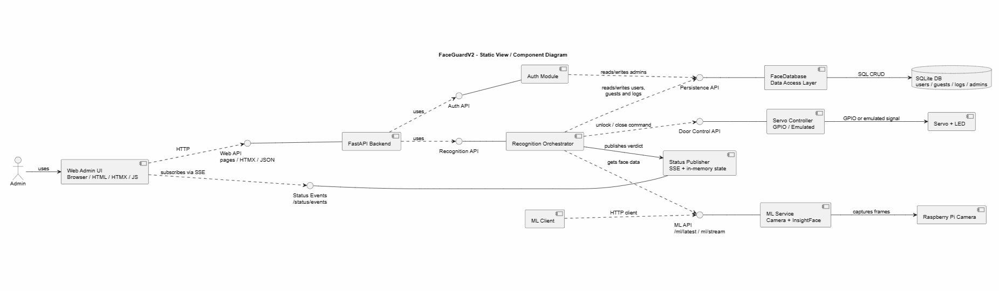
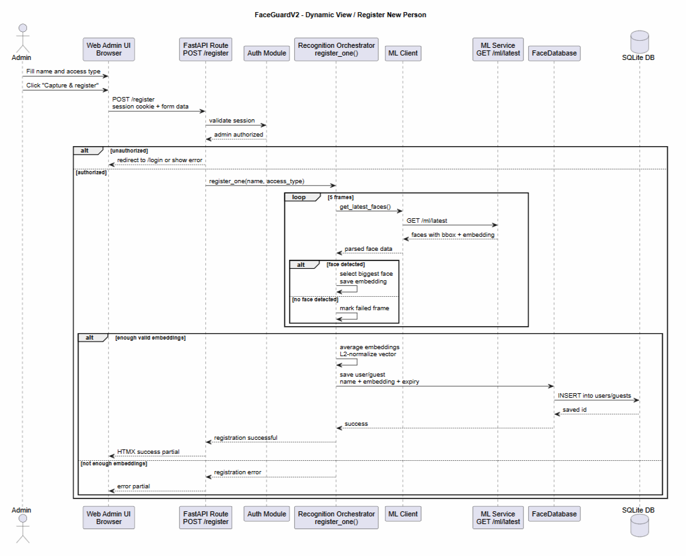
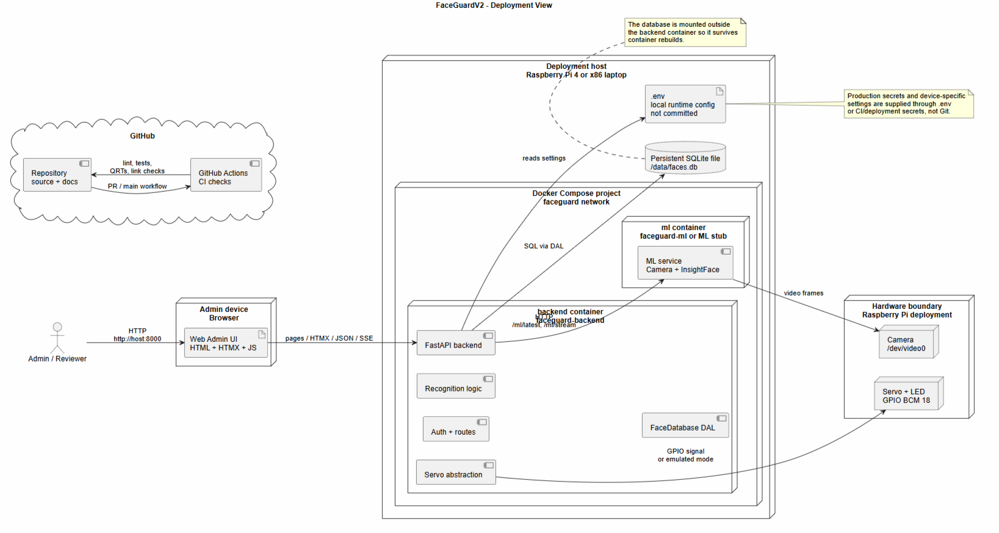

# FaceGuardV2 Architecture

**Since:** Assignment 5  
**Status:** Maintained architecture artifact  
**Scope:** Current delivered FaceGuardV2 architecture for MVP v2 development

This document is the maintained architecture index for FaceGuardV2. It explains the current delivered architecture, the main views used to reason about the system, and the architecture decisions that affect quality, maintainability, deployment, and future change.

FaceGuardV2 is a face-recognition access-control system. The current product architecture uses a FastAPI backend with a web admin interface, a separate ML service for camera/embedding extraction, SQLite persistence, and a servo-control abstraction that can run either on Raspberry Pi GPIO or in emulated mode for development and testing.

## Architecture view index

## Architecture view index

| View | Rendered diagram | Source artifact | What it helps reason about |
|---|---|---|---|
| Static view | [component-diagram.png](static-view/component-diagram.png) | [component-diagram.puml](static-view/component-diagram.puml) | Main components, responsibilities, external devices, database, and service boundaries. |
| Dynamic view | [register-new-person-sequence.png](dynamic-view/register-new-person-sequence.png) | [register-new-person-sequence.puml](dynamic-view/register-new-person-sequence.puml) | The registration workflow across UI, backend, auth, ML service, recognition logic, and persistence. |
| Deployment view | [deployment-diagram.png](deployment-view/deployment-diagram.png) | [deployment-diagram.puml](deployment-view/deployment-diagram.puml) | Runtime containers, host/device boundaries, persistent data, hardware access, and CI context. |

The diagrams are stored both as rendered images and as PlantUML source files. The `.png` files make the documentation readable directly in GitHub, while the `.puml` files keep the diagrams maintainable as diagrams-as-code.

To render the diagrams locally:

```bash
plantuml -tpng docs/architecture/static-view/component-diagram.puml
plantuml -tpng docs/architecture/dynamic-view/register-new-person-sequence.puml
plantuml -tpng docs/architecture/deployment-view/deployment-diagram.puml
```

## Static View: Component Diagram



**Source:** [component-diagram.puml](static-view/component-diagram.puml)

The component diagram shows the main internal components of FaceGuardV2 and the external systems or devices that they interact with.

The key structure is:

- **Web Admin UI** is the browser-facing interface used by the admin.
- **FastAPI Backend** owns web routes, authentication, recognition orchestration, status publishing, persistence access, and door-control decisions.
- **Auth Module** validates admin sessions and protects private web operations.
- **Recognition Orchestrator** coordinates registration, recognition, access decisions, status updates, logging, and servo commands.
- **ML Client** hides HTTP communication with the ML service.
- **ML Service** owns camera access, frame processing, face detection, and embedding extraction.
- **FaceDatabase Data Access Layer** is the only component that directly talks to SQLite.
- **Status Publisher** stores current recognition/door state and exposes it through SSE.
- **Servo Controller** abstracts physical GPIO control and the development/test emulator.
- **SQLite DB** stores admins, users, guests, and audit logs.
- **Raspberry Pi Camera** and **Servo + LED** are external hardware devices in the production-like deployment.

### Coupling and cohesion

The current design has useful separation of responsibilities:

- Camera and embedding extraction are isolated in the ML service, so the backend does not directly depend on OpenCV/InsightFace internals.
- SQL access is concentrated in `FaceDatabase`, so recognition, auth, and routes do not duplicate raw database logic.
- Door control is isolated behind the servo abstraction, allowing the same backend logic to run on real hardware or in emulated mode.
- Status updates are separated from recognition logic through the in-memory state/SSE publisher.

The main coupling risk is that the recognition workflow still coordinates several important responsibilities at once: polling ML output, selecting faces, averaging embeddings, calling persistence, publishing status, and triggering door control. This is acceptable for the current MVP, but future changes should keep the orchestration layer thin and move reusable policy logic into testable services where possible.

### Maintainability implications

This structure supports maintainability because most changes have a clear location:

- UI changes usually affect routes, templates, static files, or HTMX partials.
- Camera and embedding changes usually affect the ML service or ML client boundary.
- Persistence changes should go through the DAL and schema migration/update process.
- Hardware behavior changes should go through the servo abstraction.
- Authentication changes should remain inside the auth module and protected routes.

The main future maintainability concern is schema evolution. SQLite is simple and appropriate for the MVP, but later multi-device or multi-admin deployments may need migrations, stronger backup rules, or a separate database service.

### Quality requirements supported or constrained

The static structure supports these maintained quality requirements:

- [`QR-001 Correct face recognition decision`](../quality-requirements.md#qr-001-correct-face-recognition-decision): the backend owns comparison logic while the ML service owns embeddings, making recognition decisions testable at the backend level.
- [`QR-002 Expired guest access denial`](../quality-requirements.md#qr-002-expired-guest-access-denial): the DAL and recognition logic have one place to enforce guest expiry.
- [`QR-003 Secure password verification`](../quality-requirements.md#qr-003-secure-password-verification): authentication is separated from recognition and UI rendering.
- [`QR-004 Servo emulator operability`](../quality-requirements.md#qr-004-servo-emulator-operability): servo behavior is abstracted so it can be tested without physical GPIO.
- [`QR-005 Recognition audit logging`](../quality-requirements.md#qr-005-recognition-audit-logging): access decisions are routed through backend recognition logic and persistence, so logging can be enforced centrally.

The structure constrains performance and availability because the backend depends on the ML service for fresh face data. If the ML service is slow, unavailable, or cannot access the camera, recognition and registration are degraded. The current MVP treats this as an operational risk and exposes status/error states rather than trying to run recognition fully inside the backend.

## Dynamic View: Register New Person



**Source:** [register-new-person-sequence.puml](dynamic-view/register-new-person-sequence.puml)

The sequence diagram documents the **Register New Person** workflow.

The scenario starts when an admin opens the registration page, fills the person name and access type, and clicks **Capture & register**. The browser sends a `POST /register` request to the backend. The backend validates the session, then asks the recognition orchestrator to collect several face samples. The orchestrator polls the ML service through the ML client, chooses the biggest detected face, collects embeddings from multiple frames, averages and L2-normalizes the vector, and saves the result as either a permanent user or temporary guest through the database access layer.

The diagram also shows two important failure paths:

- unauthorized users are redirected to login or receive an error;
- registration fails if not enough valid embeddings are collected.

### Why this scenario matters

This workflow crosses the most important boundaries in the system:

- browser to backend through authenticated HTTP;
- backend route to authentication module;
- backend orchestration to ML service through HTTP;
- recognition logic to database persistence;
- backend to UI through HTMX success/error partials.

Because the registered embedding becomes future access-control data, mistakes in this flow can break recognition correctness, guest-access integrity, and auditability.

### Architecture reasoning supported by this view

The dynamic view helps reason about:

- whether the ML service boundary is clear enough;
- whether registration can be tested without real hardware by stubbing ML responses;
- where errors should be handled when no face is detected;
- where quality requirement tests can verify embedding selection, expiry rules, password/session checks, and persistence behavior;
- why registration is not only a UI operation but a cross-component product workflow.

Relevant quality requirements:

- [`QR-001`](../quality-requirements.md#qr-001-correct-face-recognition-decision) because registration quality affects future recognition decisions.
- [`QR-002`](../quality-requirements.md#qr-002-expired-guest-access-denial) because temporary registrations must carry expiry data.
- [`QR-003`](../quality-requirements.md#qr-003-secure-password-verification) because registration is an admin-only operation.
- [`QR-005`](../quality-requirements.md#qr-005-recognition-audit-logging) because later access attempts depend on traceable stored identities.

## Deployment View



**Source:** [deployment-diagram.puml](deployment-view/deployment-diagram.puml)

The deployment diagram shows the runtime structure used by the current product.

The main deployment model is a Docker Compose setup running on either:

- a Raspberry Pi 4 for hardware-oriented usage with camera and GPIO servo control;
- an x86 laptop for development, review, and testing with emulated servo mode and, where needed, an ML stub.

The deployment contains:

- a **backend container** running the FastAPI backend;
- an **ML container** running the camera/InsightFace service or development stub;
- a **persistent SQLite file** mounted under `/data`;
- a local `.env` file supplying runtime configuration;
- optional hardware devices: `/dev/video0` camera and GPIO-connected servo/LED;
- GitHub Actions as the CI environment for PR/main checks, not as a production runtime component.

### Why this deployment model was chosen

Docker Compose was selected because the product has two runtime services with a clear boundary: backend and ML service. Compose keeps local setup close to production-like Raspberry Pi setup while still allowing development on laptops. SQLite was selected for the MVP because it keeps deployment simple and avoids requiring a separate database server for a small access-control prototype.

### How the deployment supports or constrains the product

The deployment supports:

- local review and testing through emulated hardware;
- Raspberry Pi operation with real camera and GPIO servo;
- stable backend-to-ML communication through the Compose network;
- persistent data across backend container rebuilds through the mounted `./data:/data` volume;
- configuration through `.env` without committing secrets.

The deployment constrains:

- horizontal scaling, because SQLite and local device access are host-bound;
- high availability, because the MVP is a single-host deployment;
- secure production exposure, because `SESSION_COOKIE_SECURE` and HTTPS termination must be configured when deployed beyond a trusted local network;
- camera access portability, because real camera passthrough depends on the host OS and device mapping.

### Deployment and operation considerations

When deploying or operating the product, the team must consider:

- `.env` must be created from `.env.example` and real secrets must not be committed.
- `SECRET_KEY`, admin credentials, threshold, ML service URL, servo mode, and GPIO pin must match the target environment.
- Raspberry Pi deployments require correct `/dev/video0` access and servo wiring.
- x86 development deployments should use `SERVO_MODE=emulated`.
- The SQLite file in `/data/faces.db` should be backed up if the deployment stores important identities or logs.
- Public demos and screenshots must use sanitized demo data only.

## Architecture decisions

The ADR set is stored in [`adr/`](adr/). The architecture described above is supported by these current decisions:

| ADR | Status | Related quality requirements |
|---|---|---|
| [`ADR-001 Separate backend and ML service`](adr/ADR-001-separate-backend-and-ml-service.md) | Accepted | QR-001 |
| [`ADR-002 Use SQLite through FaceDatabase DAL`](adr/ADR-002-use-sqlite-through-face-database.md) | Accepted | QR-002, QR-005 |
| [`ADR-003 Use session authentication and password hashing`](adr/ADR-003-session-auth-and-password-hashing.md) | Accepted | QR-003 |
| [`ADR-004 Use servo abstraction with emulated mode`](adr/ADR-004-servo-abstraction-with-emulated-mode.md) | Accepted | QR-004 |

## Traceability

| Architecture element | Related requirements / evidence |
|---|---|
| Recognition Orchestrator | QR-001, QR-002, QR-005; QRTs in [`../quality-requirement-tests.md`](../quality-requirement-tests.md) |
| FaceDatabase DAL | QR-001, QR-002, QR-005; database tests and audit-log QRTs |
| Auth Module | QR-003; password-hash QRT |
| Servo Controller | QR-004; emulated-servo QRT |
| ML service boundary | QR-001; registration and recognition workflows |
| Docker Compose deployment | Local reproducibility, Pi deployment, and hardware/device boundary |

Architecture documentation is maintained together with the product. If the product scope, deployment model, service boundaries, quality requirements, or important risks change, this document and the relevant diagrams/ADRs must be updated in the same PR or in a linked follow-up PBI.
