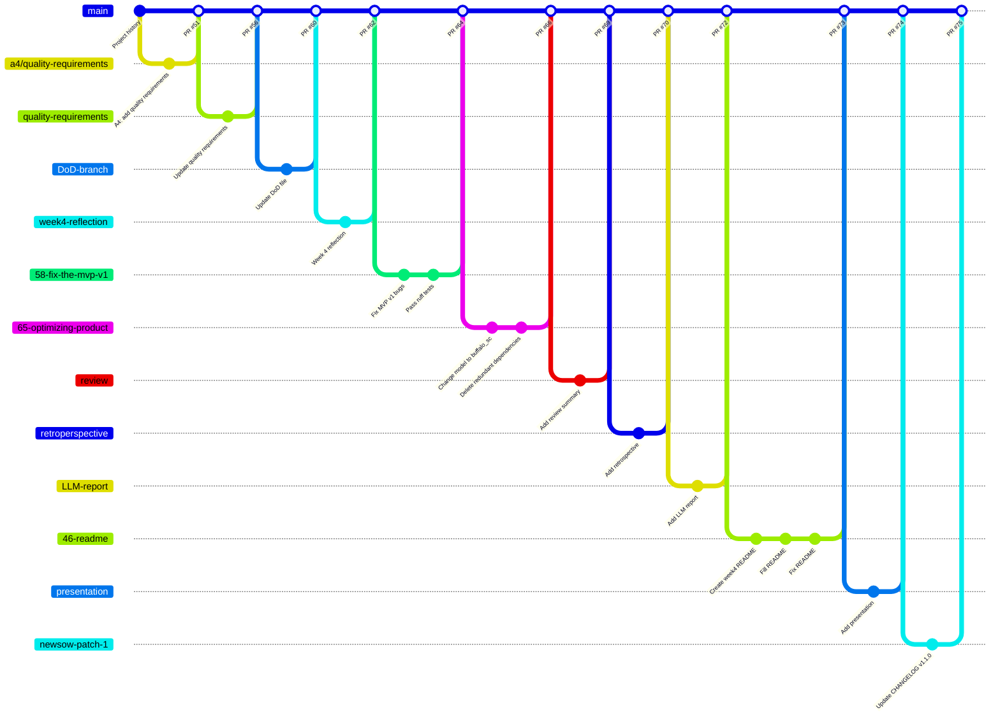

# Development Process and Configuration Management

**Since:** Assignment 5  
**Status:** Maintained canonical process artifact  
**Scope:** FaceGuardV2 product repository

This document describes the development process the team actually uses in the FaceGuardV2 repository. It is the maintained artifact for the team's development process and configuration-management documentation. The repository is developed publicly on GitHub as a monorepo: product code, documentation, reports, CI configuration, and release evidence are stored in one repository.

## Process overview

The team uses an issue-linked Scrum workflow adapted to a small student product team. GitHub Issues are the source of tracked work, GitHub milestones represent Sprint containers, Pull Requests are the default implementation and review evidence, and GitHub Actions provide automated quality gates.

Active product development continues in `MVP_v1/`, because that directory contains the FastAPI backend, web admin interface, ML-service boundary, and access-control runtime used for the current increment. Assignment 5 maps the next delivered product increment to `MVP v2`. Historical MVP v0 work is kept in `MVP_v0/` for traceability, but new product and maintained-documentation work happens through issues, branches, PRs, CI checks, and reviewed changes on `main`.

## Backlog and board configuration

The team manages work through GitHub Issues, milestones, labels, and project or issue views. The issue tracker is the authoritative place for live execution state. Maintained documentation files summarize stable artifacts and traceability, but they do not replace the issue tracker as the work-management board.

### Product Backlog

The Product Backlog contains Product Backlog Items (PBIs) that improve the product or the maintained product repository. PBIs include user stories, bugs, technical tasks, testing work, infrastructure work, quality work, architecture work, and maintained documentation that improves the product repository.

Course-only reporting or submission tasks are tracked separately as Course Tasks and do not count as PBIs.

The team uses the following issue templates:

- **User Story** — for stable user-facing requirements.
- **Other PBI** — for product work that is not written as a user story.
- **Bug Report** — for defects with reproduction steps and fix acceptance criteria.
- **Course Task** — for assignment evidence or reporting work that is not a PBI.

The Product Backlog view is the open set of PBI issues that are not closed and are not Course Tasks. Items near the top of the backlog are refined with clearer descriptions, acceptance criteria, estimates, implementer, and reviewer.

### Sprint Backlog

The Sprint Backlog is represented by the current Sprint milestone and the selected issue set for that milestone. Each Sprint issue must have enough information to start work without major ambiguity:

- clear expected outcome;
- acceptance criteria;
- estimate in story points where applicable;
- assigned implementer;
- different reviewer;
- Sprint milestone;
- current Work Status.

The team uses Monday-to-Sunday Sprints unless the course schedule requires an adjustment. Sprint Planning selects the Sprint PBIs, records the Sprint Goal in the milestone or report, and keeps the Sprint scope inspectable through the milestone and issue state.

### Views used by the team

The team uses these inspectable GitHub views, project views, or equivalent GitHub filters:

| View | Purpose | Typical filter or container |
|---|---|---|
| Product Backlog | Open product work not yet selected for a Sprint | Open PBI issues excluding Course Tasks |
| Sprint Backlog | Work selected for the current Sprint | Current Sprint milestone |
| Review | Work waiting for review | Open PRs linked to Sprint issues or issues in `Review` |
| Done / Sprint evidence | Completed Sprint work | Closed issues and merged PRs in the Sprint milestone |
| Course Tasks | Assignment reporting/submission work | Issues created from the Course Task template |

The Sprint Backlog view must stay inspectable during the Sprint and after submission, so reviewers can see what was selected, who was responsible, what was reviewed, and what was completed.

## Work Status and entry criteria

The team uses the following Work Status values consistently in issue bodies, labels, project status fields, or Sprint tracking notes.

| Status | Meaning | Entry criteria |
|---|---|---|
| `To Do` | The issue exists in the Product Backlog but is not ready to start now. | The issue has been created and is visible, but it may still need clarification, estimation, assignment, or Sprint selection. |
| `Ready` | The issue is selected for the current Sprint and can be started. | The issue has a clear outcome, acceptance criteria, estimate where applicable, implementer, reviewer, and Sprint milestone. |
| `In Progress` | Implementation or documentation work has started. | A team member has taken responsibility for the issue and usually created a branch from it. |
| `Review` | The current change is ready for another team member to inspect. | A linked PR is open, the PR template is filled, acceptance-criteria verification is included, and relevant local checks/tests are documented. |
| `Done` | The issue is complete for the Sprint. | Acceptance criteria are satisfied, Definition of Done is satisfied, the linked PR is approved and merged into `main`, required CI gates pass, and verification evidence is preserved. |

A user-story issue is Done only when its own acceptance criteria are satisfied and all linked supporting PBIs required for the story are reviewed, merged, verified, and marked Done.

## Definition of Done

The maintained Definition of Done is stored in [`docs/definition-of-done.md`](definition-of-done.md). In normal work, a PBI can be moved to Done only when:

- issue-specific acceptance criteria are satisfied;
- another team member reviewed the work;
- the linked PR was merged into protected `main`;
- required CI checks passed;
- relevant tests and quality requirement tests passed or were explicitly not applicable;
- relevant documentation, testing status, changelog, and architecture artifacts were updated when the change affected them;
- evidence is preserved in the linked issue, PR, CI run, release, report, or maintained documentation.

## Git and review workflow

The team uses a simple issue-linked feature-branch workflow.

1. **Create or refine an issue.** Work starts from a GitHub issue. The issue is created with the appropriate template and includes description, acceptance criteria, expected evidence, implementer, and reviewer where applicable.
2. **Select the issue for a Sprint.** During Sprint Planning or refinement, the issue is assigned to the current Sprint milestone and moved to `Ready` when it is clear enough to start.
3. **Create a branch.** The branch is created from `main`, preferably from the issue page. The current naming rule is `<issue-number>-short-description`, for example `58-fix-the-mvp-v1`. Some older branches in the repository history used shorter names such as `quality-requirements`, `review`, or `presentation`; those are kept as historical evidence, but new work should use issue-linked names where practical.
4. **Implement the focused change.** The branch should contain one focused product or maintained-documentation change where practical. Commits should describe the work clearly.
5. **Open a Pull Request.** The PR targets `main` and uses `.github/pull_request_template.md`. The template records the related issue, summary of changes, testing performed, acceptance-criteria verification, reviewer checklist, and changelog decision.
6. **Run checks.** GitHub Actions run on PRs. The team also records manual testing in the PR when manual verification is needed.
7. **Review by another team member.** The PR author does not approve their own work. The reviewer checks the changed files, acceptance criteria, tests, secrets, documentation impact, and Definition of Done.
8. **Merge with a merge commit.** After approval and passing checks, the PR is merged into `main`. The workflow preserves PR evidence and merge history. Squash/rebase merging should not be used for assignment evidence.
9. **Resolve the issue.** The PR should use `Closes #...` when possible. After merge, the issue is moved to Done or closed, and any remaining follow-up work is created as a separate issue.
10. **Release and changelog when needed.** User-visible changes update `CHANGELOG.md`. Submitted MVP increments are mapped to SemVer releases and Git tags from commits on `main`.

## Git workflow diagram



The diagram shows the workflow that the team has actually used: work branches are created from `main`, one or more focused commits are made on the branch, and the branch is merged back through a Pull Request. Several branches are product-focused, such as `58-fix-the-mvp-v1` and `65-optimizing-product`. Other branches maintain course-required product repository artifacts, such as quality requirements, Definition of Done, Week 4 report files, retrospective, LLM report, README, and changelog.

The diagram also shows the transition from earlier descriptive branch names to issue-linked branch names. The current rule is to use issue-number branches where practical, but the historical branches are retained because they are real repository evidence.

## Traceability

The team preserves traceability through stable links between requirements, issues, PRs, tests, documentation, and releases.

| Artifact | Traceability role |
|---|---|
| User-story issue | Live detailed requirement and acceptance criteria |
| [`docs/user-stories.md`](user-stories.md) | Maintained stable user-story index |
| Supporting PBI or bug issue | Implementation, testing, documentation, or fix work |
| Pull Request | Review, implementation evidence, testing performed, acceptance-criteria verification |
| CI run | Automated verification evidence |
| [`docs/testing.md`](testing.md) | Current testing and QA status overview |
| [`docs/quality-requirements.md`](quality-requirements.md) | Stable quality requirements |
| [`docs/quality-requirement-tests.md`](quality-requirement-tests.md) | Automated QRT definitions and evidence locations |
| ADRs | Architecture decisions and quality-relevant rationale |
| `CHANGELOG.md` and releases | Delivered user-visible increments |
| Weekly reports | Assignment-level public index of required evidence |

When a user story is removed, split, or superseded, the stable ID should remain in the maintained user-story index with a short explanation instead of being deleted.

## Configuration and secrets management

The repository is public, so secrets and private data must not be committed.

### Secrets storage

Secrets are stored outside Git:

- local runtime secrets are placed in `.env` files on each developer machine or deployment device;
- CI secrets, if needed, are stored in GitHub Actions Secrets;
- private customer evidence, recordings, credentials, consent evidence, and exact private timecodes are shared only through private assignment channels, not through the public repository.

The repository may use GitHub's built-in `GITHUB_TOKEN` for actions such as link checking. Product secrets such as `SECRET_KEY`, admin passwords, and deployment-specific values are not committed.

### Ignored files

The repository ignores local and generated files that must not be committed, including:

- `.env`, `.env.local`;
- Python virtual environments and caches;
- SQLite databases such as `*.db`, `*.sqlite`, and related journal/WAL files;
- generated outputs, logs, temporary files, build artifacts, and coverage files;
- local datasets and dataset directories;
- downloaded InsightFace cache/model data;
- model weight formats such as `*.onnx`, `*.pth`, `*.pkl`, and `*.bin`.

### Runtime configuration

Runtime configuration is supplied through environment variables. Developers copy sanitized example files and edit local private values:

```bash
cp .env.example .env
cd MVP_v1
cp .env.example .env
```

Important runtime variables include:

- `SECRET_KEY` for session/security configuration;
- `ADMIN_USERNAME` and `ADMIN_PASSWORD` for admin access;
- `THRESHOLD` for recognition decision threshold;
- `ML_SERVICE_URL` for backend-to-ML-service communication;
- `SERVO_MODE` and `SERVO_PIN` for GPIO or emulated servo mode;
- database path and other deployment-specific values.

The committed `.env.example` files are sanitized examples. Real `.env` files remain local and ignored.

### CI and deployment configuration

CI configuration is stored in `.github/workflows/`. The workflow files are public and must not contain secrets directly. If deployment automation later needs credentials, they must be referenced through GitHub Actions Secrets.

There is no continuous deployment pipeline at the current stage. Deployment is manual: the product is run locally or on Raspberry Pi using Docker Compose and environment variables. Releases and tags are created manually from commits on `main` when a submitted increment needs release evidence.

## Reproducible development environment

The current reproducible setup path is containerized development with Docker Compose for MVP v1/MVP v2 work. The expected local setup is:

```bash
git clone https://github.com/Innopolis-Robotics-Society/FaceGuardV2.git
cd FaceGuardV2/MVP_v1
cp .env.example .env
# edit SECRET_KEY, ADMIN_PASSWORD, THRESHOLD, ML_SERVICE_URL, SERVO_MODE, and other local values
docker compose up --build
```

For local Python-only development, developers use Python 3.11 and install the development dependencies from the MVP v1 package configuration:

```bash
cd MVP_v1
pip install -e ".[dev]"
pytest -v
pytest -m qrt -v
ruff check app/ ml_stub/ tests/
ruff format --check app/ ml_stub/ tests/
```

The repository does not currently use Nix or `devenv`. Docker Compose is the defined setup path because it matches the backend, ML-service boundary, and Raspberry Pi deployment model more closely than a developer-specific virtual environment.

## CI process

The team uses GitHub Actions on Pull Requests to `main` and pushes to `main`.

The main CI workflow runs:

- `lint-and-type`: Ruff linting, Ruff formatting check, and mypy for the backend app;
- `build`: Docker image build for MVP v1/MVP v2 runtime;
- `test-and-coverage`: pytest unit/integration tests excluding QRTs, with coverage artifact upload;
- `quality-requirement-tests`: automated QRTs using `pytest -m qrt`;
- `additional-qa`: dependency vulnerability/risk check using `pip-audit`.

The separate link-check workflow runs Lychee against repository Markdown and links. Lychee is a required baseline documentation check and does not replace the additional QA check.

A PR should not be merged until the relevant CI checks are passing or an explicitly documented course-approved exception exists. The latest protected-branch CI result is referenced from [`docs/testing.md`](testing.md) and weekly reports when required.

## Releases and changelog

The team maintains `CHANGELOG.md` using Keep a Changelog categories. PRs must either update a user-visible changelog entry or mark the changelog checklist as not applicable.

When the team publishes a submitted increment, the release is created from a commit on `main`, uses a SemVer tag with `v` prefix, and links the relevant report, changelog section, and runnable or release artifact.

## Documentation maintenance

This document must be updated when the team's real process changes, especially when:

- the team changes board/status configuration;
- branch or PR rules change;
- CI gates are added, removed, or replaced;
- deployment automation is introduced;
- runtime configuration or secrets handling changes;
- architecture documentation or ADR workflow changes;
- Definition of Done changes.

This document is linked from the root `README.md`, the hosted documentation site, and the Week 5 public report so that reviewers can find the current development and configuration-management process from all required entry points.
